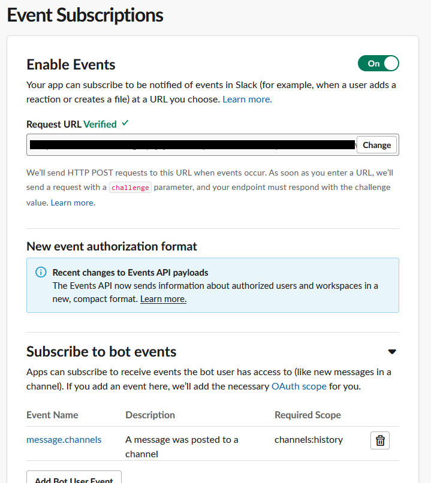

# Slack Yara Scanner

This is a lambda application intended to be installed as a Slack app in your workspace. When installed, adding it to a channel will cause it to scan every message posted to that channel.

The rules (under the [rules](./rules) folder) are defined using [Yara](https://virustotal.github.io/yara/) notation - these rules will be checked against every message, and if there are any matches, an ephemeral message will be posted to the user to notify them that they might have disclosed some secrets:


Detecting and reporting on multiple secrets are supported:


**Note**: This scanner does not *remove* or redact the messages - that requires more permissions than a bot would have, and also risks false positives. The user is merely advised to remove the secrets, and can obviously confirm and if necessary, ignore the message.

## Updating the Rules

The rules are compiled with the application via Go embed. To update the rules the scanner uses, you will need to compile it again and re-upload to Lambda. This isn't too onerous - and no changes need to be made to slack so it works straight away.

The current rules (with a few modifications, additions) come from https://github.com/pseudo-security/slacksecrets. The credit for the rules sourced from that repo are part of the rules themselves.

## Compiling

For general info, the code was built on WSl2 Ubuntu 18, using Golang 1.18. The editor used was VS Code.

Compiling is slightly tricky: the app has several dependencies, including the golang slack and lambda APIs, but [go-yara](https://github.com/hillu/go-yara) is the pain point as it requires [libyara](https://github.com/VirusTotal/yara) to compile. The goal for a smooth lambda deployment is a single binary to upload, which means ideally yara should be *statically* compiled with the go code. The approach documented is what I used below, but if you find an easier way or have issues, please let me know.

1. Download the source package of yara from here: https://github.com/VirusTotal/yara/releases. Tested with yara-4.22
2. Extract into a folder, e.g. 'yara-4.22'. I placed this folder in the same folder as the source code (you'll see it ignored in [.gitignore](./.gitignore))
3. Get go-yara v4 with `go get github.com/hillu/go-yara/v4`
4. You might need libssl installed: `sudo apt-get install libssl-dev`
5. Install go-yara with the yara source files:

    ```
    export CGO_CFLAGS="-Iyara-4.2.2/libyara/include"
    export CGO_LDFLAGS="-Lyara-4.2.2/libyara/.libs -lyara"
    go install -tags yara_no_pkg_config github.com/hillu/go-yara/v4
    ```

After this hopefully the application should be installable/runnable as normal.

This has worked too: `export CGO_LDFLAGS="-static $(pkg-config --static --libs yara)"` - after installing yara using configure and make, that embedded command returns `-L/usr/local/lib -lyara -lm`. There are further instructions on the [go-yara readme](https://github.com/hillu/go-yara#static-builds) - but I didn't find they worked as is.

## Installing Step 1: Creating the Lambda in AWS

I created an AWS Lambda with a public endpoint, unauthenticated with no triggers (as in anyone can call the URL, and that invokes the lambda). Slack authentication is handled in the source code. The Lambda app has been tested with x86_64 linux. Ensure the handler is set to `main`, so once the code is uploaded the lambda will invoke the main function which sets up the lambda.

To upload the code, build the application using `go build -o main`. It should be built for the architecture used in your lambda (e.g. x86_64 linux). Next, zip the application: `zip main.zip main`. Finally upload the zip on the code page of your lambda config.

Copy the URL - this is needed to setup slack

## Installing Step 2: Creating the app in slack

- Create an app here: https://api.slack.com/apps

Setup can be done two ways: from scratch or by using the [provided manifest](./manifest.yml) (you will need to update the URL to match your Lambda url). Below are the instructions to do this manually.

- Under 'OAuth & Permissions', get the oauth token from the workspace section
  - The app needs `channels:history` and `chat:write` permissions

    

    

- Under 'Event Subscriptions', enable event subscriptions
  - subscribe to bot events `message:channels`

    

- Use the lambda URL gathered earlier for verification - it should verify.

You can install into your workspace at any time, though you might need to do multiple times if you add those scopes after installing.

Gather the signing secret from the main app page, and the box token from the OAuth and Permissions page - it should start with `xoxb`

## Installing Step 3: Setting up environment variables in AWS

Back to AWS, add the following two environment variables with the secrets gathered from step 2:

- `SLACK_SIGNING_SECRET`
- `SLACK_API_TOKEN`

At this point the lambda should be functional. If you test it, then the logs should say forbidden, didn't come from slack or something similar. 


Note, if it complains about libyara, then the compiling step wasn't successful and yara wasn't properly included.

## Installing Step 4: Usage and Testing

All going well, the final step is to test. The app must be added to a channel, so add the app via the integrations menu, then try typing in one of the test strings from the yara rules. If its all working, the scanner should send you an ephemeral message!
